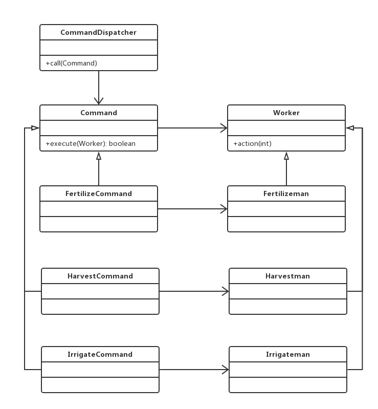

# API 说明文档

# 1 题材综述

# 1.1 介绍

基于欢乐农场的选题，开发了包括牲畜养殖，田地种植，人员任务分配，资源管理等功能的framework。

# 1.2 成员

组长：
赵伟
组员：
黄耀贤
徐伟喆
俞杨
李庆国
张宇
侯禹志
成佳杰
覃敏溢
冯玉山

# 2 Design Pattern 汇总表

见 "汇总表.docx"

# 3 实现

## 3.1 State

### 3.1.1 一套实现

#### 3.1.1.1 API描述

Plant类维护一个PlantState子类的实例，这个实例定义为当前状态，PlantState类封装一个与Plant类特定状态相关的行为，而其子类实现一个与Plant类一个状态相关的行为，如成熟时可以收割等，同时提供接口实现状态的转换

#### 3.1.1.2 class diagram

 

 ## 3.2 FlyWeight

### 3.2.1 一套实现

#### 3.2.1.1 API描述

StylePool类创建并管理BorderStyle对象，当用户请求一个BorderStyle对象时,提供一个已创建的实例或者在请求的实例不存在的情况下，新创建一个BorderStyle实例返回给用户

#### 3.2.1.2 class diagram

 

 ## 3.3 Strategy

### 3.3.1 一套实现

#### 3.3.1.1 API描述

MachineWork定义一个doWork()接口，而MachineSchedule类通过这个接口来调用MachineIrrigation等类实现的具体算法，如对作物进行浇水和收获等等

#### 3.3.1.2 class diagram

 

### 3.3.2 一套实现

#### 3.3.2.1 API描述

Buy作为一个购买的抽象父类，提供了addToList()抽象方法，在BuyLivestock和BuySeed中做不同的实现，由此可对于购买牲畜或种子饲料两种不同的行为做出不同的操作。

#### 3.3.2.2 class diagram

 

### 3.3.3 一套实现

#### 3.3.3.1 API描述

BuyLivestock作为一个购买牲畜的抽象父类，提供了create()抽象方法，在其子类中做不同的实现，由此可对于购买不同牲畜的行为做出不同的操作。

#### 3.3.3.2 class diagram

 ## 3.4 Mediator

### 3.4.1 一套实现

#### 3.4.1.1 API描述

Carrier类定义了一个carryToWareHouse接口用于Warehouse类和Product类、Plant类之间的协调操作，如将Plant类生产的产品放入仓库，由Warehouse类实例保存

#### 3.4.1.2 class diagram

 

 ### 3.4.2 一套实现

 #### 3.4.2.1 API描述

 各种牲畜(pig,ox,cow,chook等)通过livestock类访问livestockstate。livestockstate中封装了牲畜的各种行为，如喂食，饮水及状态转换等操作。

#### 3.4.1.2 class diagram

 ## 3.5 Abstract Factory

### 3.5.1 一套实现

#### 3.5.1.1 API描述

WorkFactory类既提供接口产生Worker类实例也提供接口生成WorkAdapter类的实例

#### 3.5.1.2 class diagram

 

 ## 3.6 Builder

### 3.6.1 一套实现

#### 3.6.1.1 API描述

Builder类提供接口产生指定BuildingAction的子类实例，通过调用相同的函数实现不同实例创建

#### 3.6.1.2 class diagram

 

### 3.6.2 一套实现

#### 3.6.2.1 API描述

LivestockFarm创建并管理各个存储Livestock的ArrayList。Animalhouse通过implement接口BuildingAction来继承接口，Animalhouse实现生成LivestockFarm。LivsetockFarmDirector执行Animalhouse生成LivestockFarm的动作。

#### 3.6.2.2 class diagram

 ## 3.7 Bridge 

### 3.7.1 一套实现

#### 3.7.1.1 API描述

BorderStyle类提供接口供Title类实例进行调用，进而改变样式。StyleA等类实现父类函数

#### 3.7.1.2 class diagram

 

 ## 3.8 Composite  

### 3.8.1 一套实现

#### 3.8.1.1 API描述

Animalhouse类和LivestockFarm类共同继承BuildingAction类，Animalhouse类中含有LivestockFarm类的实例的集合，并提供接口函数

#### 3.8.1.2 class diagram

 

## 3.9 Decorator   

### 3.9.1 一套实现

#### 3.9.1.1 API描述

Manager类实现call函数进行人员工作调用，SuperManager类继承于Manager类，类中保有一个Manager类实例，并重写Manager类的call函数，对其进行装饰，在对人进行命令同时可对机器下达指令

#### 3.9.1.2 class diagram

 

## 3.10 Proxy    

### 3.10.1 一套实现

#### 3.10.1.1 API描述

FarmMaster类和Manager类共同继承于CommandDispatcher类，分别实现了父类中声明的call函数，但FarmMaster类中的call函数实际调用了Manager类中的call函数进实现命令的下达

#### 3.10.1.2 class diagram

 

## 3.11 Command     

### 3.11.1 一套实现

#### 3.11.1.1 API描述

CommandDispatcher类通过call函数下达指令，Worker类作为Receiver提供action来实现命令的实际执行，Command类提供了execute函数进行任务的执行，其中调用指定的Worker的action函数实现命令的执行

#### 3.11.1.2 class diagram

 

## 3.12 Iterator     

### 3.12.1 一套实现

#### 3.12.1.1 API描述

LivestockFarm类作为集合体，保有一系列Livestock的实例，Iterator类作为迭代器，提供hasNext()和next()接口实现访问和遍历

#### 3.12.1.2 class diagram

 

## 3.13 Observer      

### 3.13.1 一套实现

#### 3.13.1.1 API描述

Factory类作为被观察者，保有一个Seller类的实例，而Seller类作为观察者，在Factory类调用dealAndSell()函数是调用Sale类中的静态函数sale()实现生产出产品的直接售卖

#### 3.13.1.2 class diagram

 

## 3.14 Façade      

### 3.14.1 一套实现

#### 3.14.1.1 API描述

在整个农场系统中，FieldContainer类作为整个系统的接口为外界提供开垦田地，播种，浇水，收割等接口，而Land类、Plant类则保有在系统内部，根据FieldContainer类接口的调用来实现响应的功能

#### 3.14.1.2 class diagram

 

 ## 3.15 Prototype

 ### 3.15.1 一套实现

 #### 3.15.1.1 API描述

 Livestock类创建并管理各种牲畜对象，如pig，cow等，当进行购买动作后，自动新增对应牲畜对象。

#### 3.15.1.2 class diagram

### 3.15.2 一套实现

#### 3.15.2.1 API描述

创建一个基类Wstate,然后扩展该类的实体为Sunny,Windy,Rainy。请求调用时调用Wstate中的findandclone函数，就会生成之前从未用过的类型到_states[10]数组中，之后会从该数组中克隆想要的类返会给调用者

#### 3.15.2.2 class diagram

### 3.15.3 一套实现

#### 3.15.3.1 API描述

创建一个基类 Goods 和扩展了 Goods 类的实体类。下一步是定义类 ShapeCache，该类把 shape 对象存储在一个 Hashtable 中，并在请求的时候返回它们的克隆。

#### 3.15.3.2 class diagram

## 3.16 Template Method

### 3.16.1 一套实现

#### 3.16.1.1 API描述

BuyLivestock作为泛化父类，其中create()为抽象函数，在start()中使用了create()和已经声明并定义的函数addToList()，作为模板函数。而create()是在BuyLivestock的子类BuyChook、BuyPig、BuyOx，BuySheep等子类中实现的。

#### 3.16.1.2 class diagram

 

 ## 3.17 Singleton

### 3.17.1 一套实现

#### 3.17.1.1 API描述

ResList类中会声明一个静态对象ResList r，并提供唯一访问接口Instance()来对其进行访问，以此实现全局仅有一个ResList单例用于存储农场的各种信息。

#### 3.17.1.2 class diagram

 

## 3.18 Factory Method

### 3.18.1 一套实现

#### 3.18.1.1 API描述

在父类BuyLivestock中定义一个返回Livestock类对象的抽象函数create()，并在其子类中进行实现，由此可以在Livestock中有新的子类时，可以新增一个BuyLivestock的子类创建特定的Livestock子类对象。

#### 3.18.1.2 class diagram

 

### 3.18.2 一套实现

 #### 3.18.2.1 API描述

 Animalhouse、Warehouse、Factory是BuildingAction接口的实现，通过调用BuildingFactory中的produce函数实现房屋实例的创建。

 #### 3.18.2.2 class diagram

 

## 3.19 Memento

### 3.19.1 一套实现

#### 3.19.1.1 API描述

ResMemento用于保存ResList一个时刻的状态，用于备份和还原。createMemento()可以将ResList中信息保存到ResMemento对象中，形成数据备份；setStateFromMemento()可以将ResMemento对象中的数据还原到ResList单例中。

#### 3.19.1.2 class diagram

 

 ## 3.20 Visitor

 ### 3.20.1 一套实现

 #### 3.20.1.1 API描述

 在创建一系列天气类，诸如Sunny,Windy,Rainy类之后，会被存入Wstate中的一个Vector数组array中，只要在array数组首位调用accept函数，在函数参数内new一个ListVisitor就可以由listvisitor访问array数组并输出其中的对象，表示最近的天气状况。

 #### 3.20.1.2 class diagram

 

 ## 3.21 Chain of Responsibility

 ### 3.21.1 一套实现

 #### 3.21.1.1 API描述

 抽象类Store中有商品和原材料种类的分级，VegStore和MeatStore是依据级别对应的两种商店，通过调用Sale类的sale函数实现商品的售卖。

 #### 3.21.1.2 class diatram

 
 ## 3.22 Adapter      

### 3.22.1 一套实现

#### 3.22.1.1 API描述

通过WorkerAdapter类适配MachineSchedule类，使之可以实现Worker类职能

#### 3.22.1.2 class diagram

 
